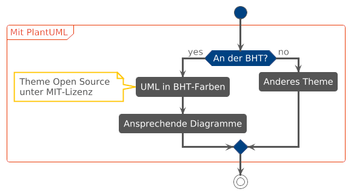

# BHT theme für PlantUML

UML-Diagramme in den Farben der 
[Berliner Hochschule für Technik (BHT)](https://www.bht-berlin.de/) können 
in [PlantUML](https://plantuml.com/de/) mit diesem Theme erstellt werden. 
Es ist eine Abwandlung des Themes [Cerulean](https://github.com/bschwarz/puml-themes). Ich verwende es, um ansprechende Diagramme für meine 
Masterarbeit zu erzeugen, welche zu den Templates der BHT passen.
Disclaimer: Ich kann nicht garantieren, dass alle Diagrammtypen und PlantUML-Features unterstützt werden. 

## Beispiel

Das Beispiel kann mit dem [PlantUML Web Server](https://www.plantuml.com/plantuml/uml/FO_1JiCm44Jl_ehbrXvItzi3BK88f5OWKJx0JIQrHRoErXiXYlXtObTb3vRNCvxHkrEF23fvfLvI9AywvhMruhvMvw1-EaqPqYPMiAxQ56q_90cE6TDdaDQ3xSFpiHa7nph5eQbvLj1dw-6wRACBRCqsgvDYCARUp3WVGKDYEWIbj_Bzux2d7qFpX9uMEwOEGdFu_PBKWsdnZRoi-hfO0nUnUN9o0c_gEoS53UYrRcME5Uzr1DDxcgG5_KiJAuGEByTc7oxWInN0NKsvrkmuZu82sO4UWpkBYn7NBWmPjE2ql5ax2FArS7FB2htvdO7JQCnsNcV-Fm00) ausprobiert werden. Das Diagramm wird durch den unten stehenden Code generiert, das Theme wird in der ersten Zeile über eine URL geladen.



```
!theme bht from https://raw.githubusercontent.com/florianneukirchen/BHT-plantuml-theme/refs/heads/main/
@startuml

start
partition Mit PlantUML {
    if (An der BHT?) then (yes)
    :UML in BHT-Farben;
    note left
        Theme Open Source 
        unter MIT-Lizenz
    end note
    :Ansprechende Diagramme;
    else (no)
    :Anderes Theme;
    endif
}
stop

@enduml
```

